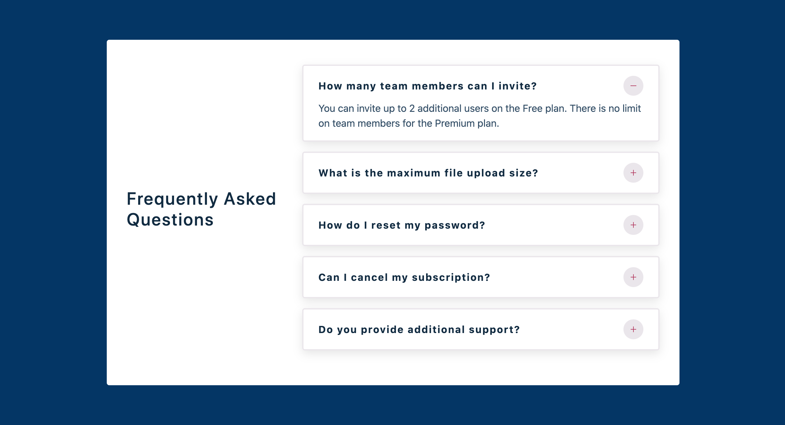

## FAQ Accordion Component

A FAQ Accordion Component written in React.js

### Idea

I got the design idea from UIDesignDaily website.

[uidesigndaily](https://uidesigndaily.com/posts/sketch-accordion-website-day-1175)


## My process

### Built with

- Semantic HTML5 markup
- CSS custom properties
- CSS Grid & Flexbox
- React.js

### What I learned

This was a fairly easy component to build. Got decent practice of useState & some JavaScript short-circuit evaluation. The JSX structure was really simple. I will be moving on to some slightly complex components from now on.

### Demo

- [Demo](https://webster-faq-accordion-react.netlify.app)

### Screenshot:



### Demo:


#### React Icons

[react icons](https://react-icons.github.io/react-icons/)

```
npm install react-icons --save
```

```javascript
import { FaHome } from 'react-icons/fa'
const Component = () => {
  return <FaHome className="icon"></FaHome>
}
```
